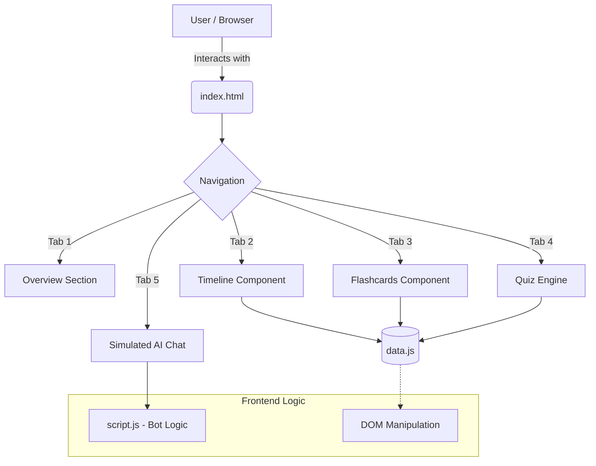

# Election Assist India 🇮🇳

An interactive, AI-simulated educational web application designed to help citizens understand the Indian electoral process. The application provides a seamless and engaging experience through interactive timelines, terminology flashcards, quizzes, and a simulated AI chat assistant.

## ✨ Features
- **Interactive Timeline**: Step-by-step visual representation of the election cycle, from announcement to result declaration.
- **Electoral Flashcards**: 3D flippable cards covering essential terminology (EVM, VVPAT, MCC, NOTA, etc.).
- **Knowledge Quiz**: Test your understanding of the Indian democracy with an interactive MCQ quiz featuring instant feedback.
- **AI Chat Assistant**: A simulated AI chatbot that answers common questions regarding the election process, voting eligibility, and more.
- **Premium UI**: Designed with modern glassmorphism aesthetics, responsive layouts, and smooth micro-animations.

## 🏗️ Architecture & Component Diagram



## 🚀 Tech Stack
- **Frontend**: HTML5, CSS3 (Vanilla, Glassmorphism design), JavaScript (ES6+)
- **Data Management**: Centralized static data structure (`data.js`)
- **Deployment**: Containerized using Docker (`nginx:alpine`) and hosted on **Google Cloud Run**.

## 🛠️ How to Run Locally

### Using a Local Server
Since this is a static frontend project, you can serve it locally using any basic HTTP server.

**Option 1: Using Node.js (npx)**
```bash
npx serve .
```

**Option 2: Using Python**
```bash
python -m http.server 8000
```

Visit `http://localhost:8000` or the URL provided by `serve` in your browser.

## 🐳 Docker Support
This project includes a `Dockerfile` that uses `nginx` to serve the static content on port 80.

Build the image:
```bash
docker build -t election-assist-india .
```
Run the container:
```bash
docker run -p 8080:80 election-assist-india
```

## ☁️ Deployment
The application is ready to be deployed to **Google Cloud Run**:
```bash
gcloud run deploy election-assistant --source . --region us-central1 --allow-unauthenticated --port 80
```
